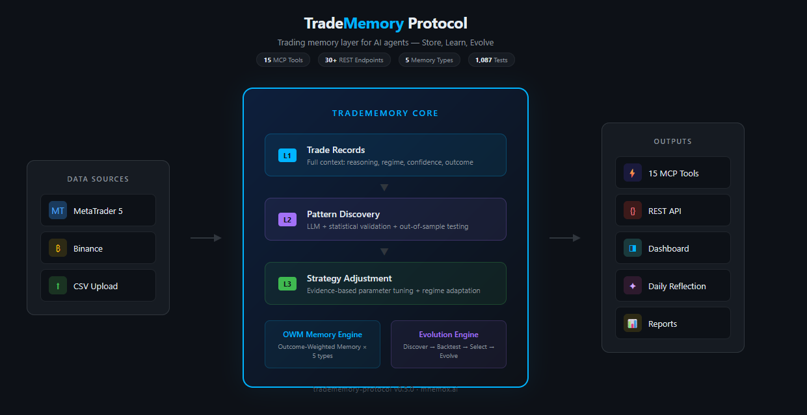

<!-- mcp-name: io.github.mnemox-ai/tradememory-protocol -->

<div align="center">

# TradeMemory Protocol

**Trading memory layer for AI agents. Store, Learn, Evolve.**

[](https://pypi.org/project/tradememory-protocol/)
[](https://github.com/mnemox-ai/tradememory-protocol/actions)
[](https://smithery.ai/server/io.github.mnemox-ai/tradememory-protocol)
[](https://opensource.org/licenses/MIT)



</div>

## What It Does

- **L1 — Store**: Record every trade with full context — entry reasoning, market regime, confidence, outcome.
- **L2 — Learn**: Auto-discover recurring patterns. LLM hypothesis → vectorized backtest → out-of-sample validation.
- **L3 — Evolve**: Adjust strategy parameters based on statistical evidence. Outcome-weighted memory downweights stale regimes.

## Quick Start

```bash
pip install tradememory-protocol
```

Add to `claude_desktop_config.json`:

```json
{
  "mcpServers": {
    "tradememory": {
      "command": "uvx",
      "args": ["tradememory-protocol"]
    }
  }
}
```

Then tell Claude: *"Record my BTCUSDT long at 71,000 — momentum breakout, high confidence."*

<details>
<summary>Claude Code / Cursor / Docker</summary>

```bash
# Claude Code
claude mcp add tradememory -- uvx tradememory-protocol

# From source
git clone https://github.com/mnemox-ai/tradememory-protocol.git
cd tradememory-protocol && pip install -e . && python -m tradememory

# Docker
docker compose up -d
```

</details>

## MCP Tools (15)

| Category | Tools |
|----------|-------|
| **Core Memory** | `store_trade_memory` · `recall_similar_trades` · `get_strategy_performance` · `get_trade_reflection` |
| **OWM Cognitive** | `remember_trade` · `recall_memories` · `get_behavioral_analysis` · `get_agent_state` · `create_trading_plan` · `check_active_plans` |
| **Evolution** | `evolution_run` · `evolution_status` · `evolution_results` · `evolution_compare` · `evolution_config` |

<details>
<summary>REST API (30+ endpoints)</summary>

Trade recording, outcome logging, history, reflections, risk constraints, MT5 sync, OWM, evolution.

Full reference: [docs/API.md](docs/API.md)

</details>

## Architecture: OWM (Outcome-Weighted Memory)

Every memory scored by 5 factors on recall:

| Factor | Role |
|--------|------|
| **Q** — Quality | Trade outcome → (0,1). Losers stay as warnings. |
| **Sim** — Similarity | Current context vs. memory formation context. |
| **Rec** — Recency | Power-law decay. 30d=71%, 1y=28%. |
| **Conf** — Confidence | High-confidence memories weighted more. |
| **Aff** — Affect | Drawdown → caution. Win streak → overconfidence check. |

> Based on ACT-R, Kelly criterion, Tulving’s taxonomy, Damasio’s somatic markers. Full spec: [OWM Framework](docs/OWM_FRAMEWORK.md)

<details>
<summary><strong>Evolution Engine — discover strategies from raw price data</strong></summary>

1. **Discover** — LLM analyzes candles, proposes candidates
2. **Backtest** — Vectorized engine (ATR SL/TP, time-based exit)
3. **Select** — In-sample rank → out-of-sample validation (Sharpe > 1.0, n > 30)
4. **Evolve** — Survivors mutate. Next generation. Repeat.

**BTC/USDT 1H, 22 months** — 477 trades, Sharpe 3.84, 91% positive months, max DD 0.22%. Zero human strategy input.

</details>

## Documentation

| Doc | Description |
|-----|-------------|
| [Architecture](docs/ARCHITECTURE.md) | System design & layer separation |
| [OWM Framework](docs/OWM_FRAMEWORK.md) | Full theoretical foundation |
| [Tutorial](docs/TUTORIAL.md) | Install → first trade → memory recall |
| [API Reference](docs/API.md) | All REST endpoints |
| [MT5 Setup](docs/MT5_SYNC_SETUP.md) | MetaTrader 5 integration |
| [Research Log](docs/RESEARCH_LOG.md) | 11 evolution experiments |
| [Roadmap](docs/ROADMAP.md) | Development roadmap |
| [中文版](docs/README_ZH.md) | Traditional Chinese |

## Contributing

See [Contributing Guide](.github/CONTRIBUTING.md) · [Security Policy](.github/SECURITY.md)

<a href="https://star-history.com/#mnemox-ai/tradememory-protocol&Date">
 <picture>
   <source media="(prefers-color-scheme: dark)" srcset="https://api.star-history.com/svg?repos=mnemox-ai/tradememory-protocol&type=Date&theme=dark" />
   
 </picture>
</a>

---

MIT — see [LICENSE](LICENSE). For educational/research purposes only. Not financial advice.

<div align="center">Built by <a href="https://mnemox.ai">Mnemox</a></div>
