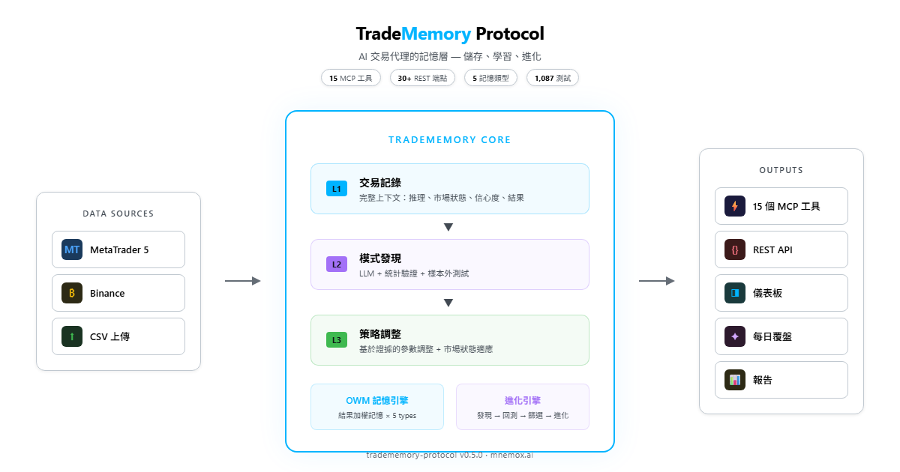
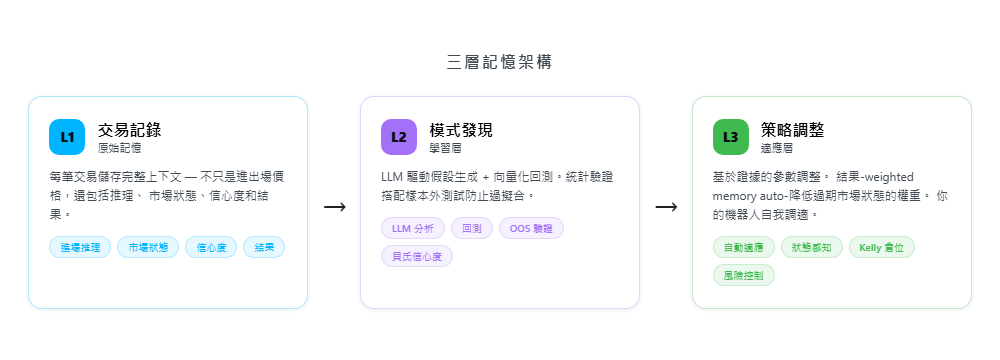
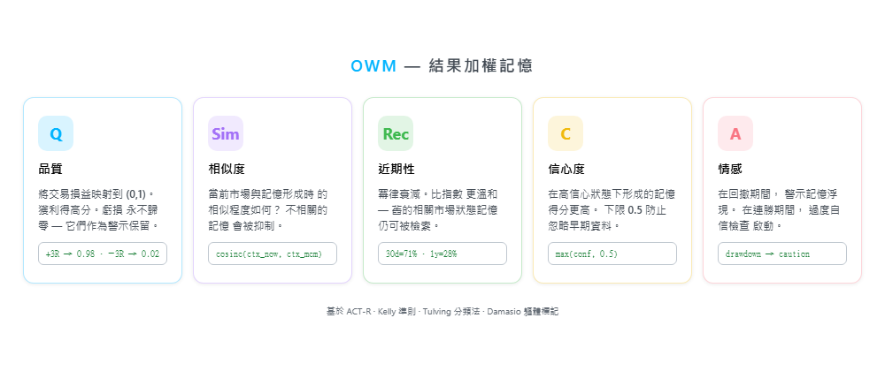
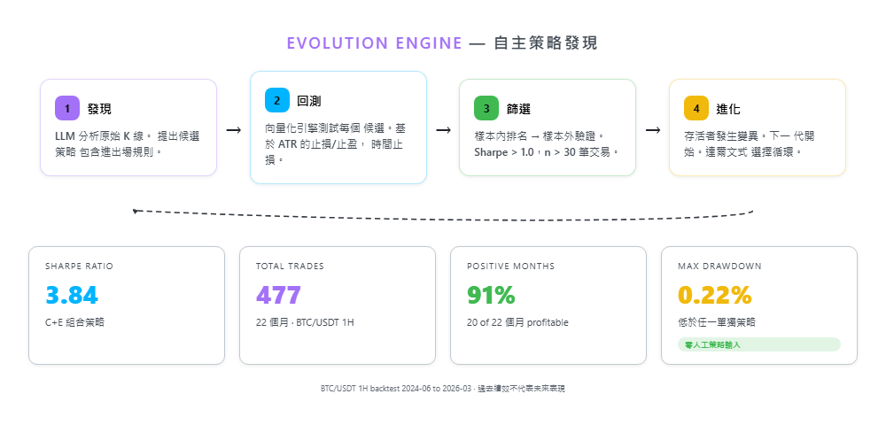

<!-- mcp-name: io.github.mnemox-ai/tradememory-protocol -->

<p align="center">
  
</p>

<div align="center">

[](https://pypi.org/project/tradememory-protocol/)
[](https://github.com/mnemox-ai/tradememory-protocol/actions)
[](https://smithery.ai/server/io.github.mnemox-ai/tradememory-protocol)
[](https://smithery.ai/server/io.github.mnemox-ai/tradememory-protocol)
[](https://opensource.org/licenses/MIT)

[Tutorial](TUTORIAL.md) | [API Reference](API.md) | [OWM Framework](OWM_FRAMEWORK.md) | [English](../README.md)

</div>

---

## 最新消息

- [2026-03] **v0.5.0** — Evolution Engine + OWM 5 種記憶類型。1,087 測試通過。[Release Notes](https://github.com/mnemox-ai/tradememory-protocol/releases/tag/v0.5.0)
- [2026-03] **統計驗證** — 策略 E 通過 P100% 隨機基線，Walk-forward Sharpe 3.24
- [2026-03] **實盤模擬交易** — 策略 E 透過 GitHub Actions 每小時在 Binance 執行
- [2026-02] **v0.4.0** — OWM 框架、15 個 MCP 工具、Smithery + Glama 上架

## 架構

<p align="center">
  
</p>

## 三層記憶

<p align="center">
  
</p>

---

## 快速開始

```bash
pip install tradememory-protocol
```

加到 Claude Desktop 設定檔 (`claude_desktop_config.json`)：

```json
{
  "mcpServers": {
    "tradememory": {
      "command": "uvx",
      "args": ["tradememory-protocol"]
    }
  }
}
```

然後對 Claude 說：

> *「記錄我在 71,000 做多 BTCUSDT — 動量突破，高信心。」*

<details>
<summary>Claude Code / Cursor / 其他 MCP 客戶端</summary>

**Claude Code:**
```bash
claude mcp add tradememory -- uvx tradememory-protocol
```

**Cursor / Windsurf / 任何 MCP 客戶端** — 加到 MCP 設定檔：
```json
{
  "mcpServers": {
    "tradememory": {
      "command": "uvx",
      "args": ["tradememory-protocol"]
    }
  }
}
```

</details>

<details>
<summary>從原始碼安裝 / Docker</summary>

```bash
git clone https://github.com/mnemox-ai/tradememory-protocol.git
cd tradememory-protocol
pip install -e .
python -m tradememory
# 伺服器運行在 http://localhost:8000
```

```bash
docker compose up -d
```

</details>

---

## 應用場景

**加密貨幣** — 從 Binance 匯入 BTC/ETH 交易。Evolution Engine 能發現你永遠找不到的時間規律，市場環境改變時自動調適。

**外匯 + MT5** — 自動同步 MetaTrader 5 的每筆平倉交易。跨 session 持久記憶讓你的 EA 記住亞盤突破只有 10% 勝率 — 然後不再下單。

**開發者** — 用 15 個 MCP 工具 + 30 個 REST 端點建構有記憶的交易 agent。你的 agent 每次啟動都知道自己的信心水準、進行中的計畫、以及哪些策略正在賺錢。

---

## OWM — 結果加權記憶

<p align="center">
  
</p>

> 完整理論基礎：[OWM Framework](OWM_FRAMEWORK.md)

## Evolution Engine

<p align="center">
  
</p>

> 方法論與數據：[Research Log](RESEARCH_LOG.md)

---

<details>
<summary><strong>Evolution Engine — 隱藏王牌</strong></summary>

Evolution Engine 從原始價格數據中發現交易策略。不用指標，不用人工規則。純 LLM 驅動的假設生成 + 向量化回測 + 達爾文式篩選。

### 運作方式

1. **發現** — LLM 分析價格數據，提出候選策略
2. **回測** — 向量化引擎測試每個候選策略（ATR-based SL/TP，多空，時間型出場）
3. **篩選** — 樣本內排名 → 樣本外驗證（Sharpe > 1.0，交易數 > 30，最大回撤 < 20%）
4. **進化** — 存活者被變異。下一代。重複。

### 實測結果：BTC/USDT 1H，22 個月（2024-06 至 2026-03）

| 系統 | 交易數 | 勝率 | RR | 利潤因子 | Sharpe | 報酬 | 最大回撤 |
|------|--------|------|----|----------|--------|------|----------|
| 策略 C (做空) | 157 | 42.7% | 1.57 | 1.17 | 0.70 | +0.37% | 0.45% |
| 策略 E (做多) | 320 | 49.4% | 1.95 | 1.91 | 4.10 | +3.65% | 0.27% |
| **C+E 組合** | **477** | **47.2%** | **1.84** | **1.64** | **3.84** | **+4.04%** | **0.22%** |

- 91% 月份正報酬（22 個月中 20 個月）
- 最大回撤 0.22% — 比任何單一策略都低
- 零人工策略輸入。LLM 從原始 K 線中自行發現這些策略。

> 數據來源：[RESEARCH_LOG.md](../docs/RESEARCH_LOG.md)。11 項實驗，完整方法論，模型比較（Haiku vs Sonnet vs Opus）。

</details>

---

## MCP 工具

### 核心記憶（4 個工具）
| 工具 | 說明 |
|------|------|
| `store_trade_memory` | 儲存交易及完整上下文 |
| `recall_similar_trades` | 尋找相似市場環境的歷史交易（有 OWM 數據時自動升級） |
| `get_strategy_performance` | 各策略匯總績效 |
| `get_trade_reflection` | 深入分析單筆交易的推理與教訓 |

### OWM 認知記憶（6 個工具）
| 工具 | 說明 |
|------|------|
| `remember_trade` | 同時寫入五層記憶 |
| `recall_memories` | 結果加權回憶，附完整評分拆解 |
| `get_behavioral_analysis` | 持倉時間、處置效應比率、Kelly 比較 |
| `get_agent_state` | 當前信心、風險偏好、回撤、連勝/連敗 |
| `create_trading_plan` | 前瞻記憶中的條件式計畫 |
| `check_active_plans` | 將進行中計畫與當前市場比對 |

### Evolution Engine（5 個工具）
| 工具 | 說明 |
|------|------|
| `evolution_run` | 執行完整的發現 → 回測 → 篩選循環 |
| `evolution_status` | 查看進化進度 |
| `evolution_results` | 取得畢業策略及完整指標 |
| `evolution_compare` | 跨世代比較 |
| `evolution_config` | 查看/修改進化參數 |

<details>
<summary>REST API（30+ 端點）</summary>

交易記錄、結果登記、歷史查詢、日/週/月反思、風險約束、MT5 同步、OWM CRUD、進化引擎調度等。

完整參考：[docs/API.md](API.md)

</details>

---

## Star History

<a href="https://star-history.com/#mnemox-ai/tradememory-protocol&Date">
 <picture>
   <source media="(prefers-color-scheme: dark)" srcset="https://api.star-history.com/svg?repos=mnemox-ai/tradememory-protocol&type=Date&theme=dark" />
   
 </picture>
</a>

---

## 貢獻

詳見 [CONTRIBUTING.md](../.github/CONTRIBUTING.md)。

- 給個 Star 追蹤進度
- 透過 [GitHub Issues](https://github.com/mnemox-ai/tradememory-protocol/issues) 回報問題
- 提交 PR 修 bug 或新增功能

---

## 文件

| 文件 | 說明 |
|------|------|
| [OWM 框架](OWM_FRAMEWORK.md) | 完整理論基礎（1,875 行） |
| [Tutorial (EN)](TUTORIAL.md) | 英文教學 |
| [教學 (中文)](TUTORIAL_ZH.md) | 完整中文教學指南 |
| [API 參考](API.md) | 所有 REST 端點 |
| [MT5 設定](MT5_SYNC_SETUP.md) | MetaTrader 5 整合 |
| [研究日誌](RESEARCH_LOG.md) | 11 項進化實驗的完整數據 |

---

## 授權

MIT — 詳見 [LICENSE](LICENSE)。

**免責聲明：** 本軟體僅供教育和研究用途。不構成投資建議。交易涉及重大虧損風險。

---

<div align="center">

由 [Mnemox](https://mnemox.ai) 打造

</div>
